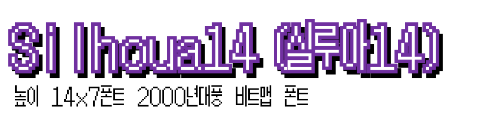

# Silua14_Font

7x14 크기의 비트맵 폰트

게임번역하다보니 해당크기의 비트맵 폰트가 없어서 작성을 하게 된 폰트입니다.
## 폰트 지원범위
* 한글11172자 + ASCII 영역을 지원합니다.

### 폰트 미리보기

## 사용 도구
* [Pixel Font Maker](https://github.com/exqt/pixel-font-maker) : 폰트 제작
### 참조 폰트
* [포켓몬스터 은 한국어 현지화 프로토타입](https://www.youtube.com/watch?v=gULKZEj0fJc&feature=emb_title) : KS X 1001 기준 `끗`∼`뷔`, `빨`∼`슭` 구간 참조 

* 파이어 엠블렘 열화의 검 : 영문+숫자+특수기호 참조

이외의 폰트는 본인이 직접 찍은 폰트이며, 참조한 폰트도 일부 가독성을 위해 변형이 들어가 있습니다.

## 다운로드

* [Silua14.ttf](Silua14.ttf)
* [Silua14.bdf](Silua14.bdf)
* ~Silua14.woff2~ - 툴에서 생성해주지 않아서 첨부를 못했습니다.

## 이 프로젝트의 라이센스

</img> 

본 저작물은 'WindowsTiger'가 2022년 작성하여 [공공누리 제1유형 저작권](LICENSE.md)으로 개방하였습니다.

이 저작물은, 출처를 명시하는 조건으로, 누구나 온·오프라인을 통하여 공유 및 이용 가능하고, 2차적 저작물로 변경하
여 이용 가능하고, 영리 목적으로도 이용할 수 있습니다.
